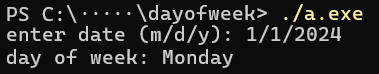

# About

This program prompts the user to enter a date, and then returns the day of the week the given date falls on.

For example:

The day of the week is calculated using John Conway's [Doomsday algorithm](https://en.wikipedia.org/wiki/Doomsday_rule). The "odd + 11" method described by Chamberlain Fong and Michael K. Walters is also used.

## Code information

This program is written in C, developed by Arthur Zarins in 2024.

To compile this program, have a C compiler installed and run `cc .\dayofweek.c`; This will create a file ('./a.out' on Linux, './a.exe' on Windows) that can then be directly run in the terminal.

## Input

User input is in a numerical month/day/year format, with a slash between values. There cannot be any spaces in the input.

Example of good input:

`1/1/2024`

Examples of bad input (an error would be thrown):

- `1-1-2024`
- `1 / 1 / 2024`
- `January 1 2024`

Furthermore, entering a nonexistant day (such as February 29 on a non-leap yeap) would result in the program declaring the day does not exist.

## Calculation

The Doomsday algorithm relies on "anchor days" for the century and year that can then be used to determine the day of the week of at least one date in each month.

For all numerical calculations, the days of the week correspond to the numbers `0` (for Sunday) through `6` (for Saturday).

### Century Anchor Day

To determine what century a year falls in, we divide the year by 100 and round down. We then determine the anchor date for the century by taking the remainder of the century divided 4.
- if the remainder is 0, the century anchor is `Tuesday`
- if the remainder is 1, the century anchor is `Sunday`
- if the remainder is 2, the century anchor is `Friday`
- if the remainder is 3, the century anchor is `Wednesday`

Example: The year `2024` is the `20`th century since `2024 / 100 = 20` (rounding down). `20 % 4 = 0`, so for the year 2024 the century anchor day of the week is Tuesday.

### Year Anchor Day

After calculating the century's anchor day, the "odd + 11" method can be used to determine the year's anchor day. The method involves the following steps:

1. let X = the last 2 digits of the year
2. if X is odd, X = X + 11
3. X = X / 2
4. if X is odd, X = X + 11
5. X = 7 - (X % 7)

knowing the century's anchor day, the year's anchor day is X days ahead of the century's anchor day like so:

- let C = the century's anchor day of week
- The year's anchor day is thus `(C + X) % 7`.

### Doomsday

The Doomsday algorithm relies on the fact that all of the following dates (month/day) all fall on the same day of the week as the year's anchor day:

`1/3, 2/28, 3/14, 4/4, 5/9, 6/6, 7/11, 8/8, 9/5, 10/10, 11/7, 12/12`

On a leap year, the days on January and February change to the following: 

`1/4, 2/29`

For any given month `M` in year `Y`, there exists a known doomsday on the numeric day `X` such that `M/X/Y` falls on the same day of the week as the year's anchor day.

Knowing this, we determine the day of the week the given date falls on is `(A + (D - X)) % 7`

where `A` is the year's anchor day of the week, `D` is the given date's day, and `X` is the day doomsday falls on in the month.

## Misc. Calendar Info

### Leap Years

Any year divisible by 4 is a leap year unless it is also divisble by 100.

An exception to this rule is if a year is divisible by 400, it is a leap year.

### Months

| Month Number | Month Name | Days in Month |
| ---| -------- | --- |
| 1  | January  | 31 |
| 2  | February | 28 or 29|
| 3  | March    | 31 |
| 4  | April    | 30 |
| 5  | May      | 31 |
| 6  | June     | 30 |
| 7  | July     | 31 |
| 8  | August   | 31 |
| 9  | September| 30 |
| 10 | October  | 31 |
| 11 | November | 30 |
| 12 | December | 31 |
